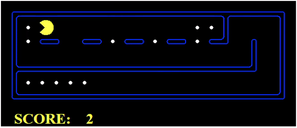
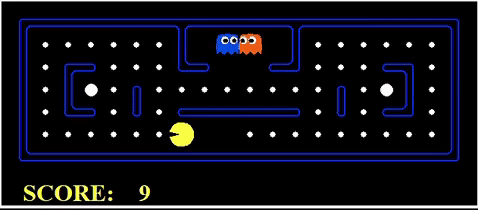

# PacMan 
**Báo cáo tiến độ bài tập lớn**\
Nhóm 20

|     STT     |     MSSV         |     Tên                    |
|-------------|------------------|----------------------------|
|     1       |     20205077     |     Lê Trường Giang        |   
|     2       |     20205015     |     Trần Minh Quân         |   
|     3       |     20200650     |     Vũ Thành Trung         |   
|     4       |     20205097     |     Hoàng Lê Tiến Long     | 
# Tiến độ thực hiện:
Nhiệm vụ của trò chơi: điều khiển pacman ăn hết food (chấm trắng) trên bản đồ và tránh né kẻ thù (Hoặc tiêu diệt kẻ thù khi ăn được chấm trắng lớn)

## Điều khiển pacman ăn hết food:
### Tìm đường đi đến food 4 góc bản đồ: Sử dụng thuật toán Astar và bổ sung heuristics

### Tìm đường đi đến food gần nhất: sử dụng thuật toán BFS

## Điều khiển Pacman hoàn thành trò chơi:
### **Sử dụng thuật toán minimax + alphabeta:**
``` python   
# in multiagents.py
class MinimaxAgent(MultiAgentSearchAgent):

    def getAction(self, gameState: GameState):\

        def value(state,  agentIndex, depth):

        def max_value(state, agentIndex, depth):
            
        def min_value(state, agentIndex, depth):

        return value(gameState, 0, 0)
       
```

triển khai thuật toán Minimax cho Pacman. Dưới đây là phân tích từng phần của đoạn code:

**Phương thức getAction(self, gameState: GameState):**

Phương thức này trả về hành động tối ưu dựa trên trạng thái hiện tại gameState, sử dụng độ sâu self.depth và hàm đánh giá self.evaluationFunction.
Phương thức gọi hàm maximize và trả về hành động tốt nhất.

**Phương thức max_value(state, agentIndex, depth):**

Phương thức này tìm kiếm các trạng thái con và trả về giá trị cao nhất
Nếu đạt đến độ sâu tìm kiếm (depth == self.depth) hoặc trạng thái là trạng thái thắng (state.isWin()) hoặc trạng thái là trạng thái thua (state.isLose()), thì phương thức trả về giá trị đánh giá của trạng thái đó.
Nếu đến lượt Pacman (agent_index == 0), phương thức gọi maximize.
Ngược lại, phương thức gọi minimize.

**Phương thức min_value(state, agentIndex, depth):**

Phương thức này thực hiện lượt chơi MIN trong thuật toán Minimax, sẽ tìm kiếm các trạng thái con và trả về giá trị thấp nhất. (Lượt chơi của ghost)
Ban đầu, giá trị nhỏ nhất (minValue) được khởi tạo là dương vô cùng.
Dùng vòng lặp để duyệt qua các hành động hợp lệ của con ma hiện tại (legal_moves).




### **Thuật toán exceptimax:**

``` python
# in multiagents.py
class ExpectimaxAgent(MultiAgentSearchAgent):

    def getAction(self, gameState: GameState):

        def value(state, agentIndex, depth):
        
        def max_value(state, agentIndex, depth):
            
        def exp_value(state, agentIndex, depth):

def betterEvaluationFunction(currentGameState: GameState):       
```
Đoạn mã trên định nghĩa hai lớp trong trò chơi Pacman: ExpectimaxAgent và betterEvaluationFunction.

**Lớp ExpectimaxAgent(MultiAgentSearchAgent):**

Một đối tượng đại diện cho một đối tượng Pacman sử dụng thuật toán Expectimax để ra quyết định về hành động tiếp theo. Trong phương thức getAction, agent gọi phương thức maximize để tìm hành động tối ưu dựa trên trạng thái hiện tại của trò chơi và một độ sâu đã cho. Phương thức maximize sẽ duyệt qua tất cả các hành động hợp lệ của Pacman, và với mỗi hành động, nó sẽ gọi đệ quy phương thức expectimax để đánh giá giá trị của trạng thái tiếp theo. Sau đó, phương thức maximize chọn hành động có giá trị cao nhất và trả về cùng với giá trị đó.

**Phương thức expectimax(self ,state : GameState, agent_index, depth):**

Là phần chính của thuật toán Expectimax. Nó xác định giá trị của một trạng thái dựa trên độ sâu đã cho và vai trò của đối tượng hiện tại (Pacman hoặc Ghost). Nếu độ sâu đã đạt tới giới hạn hoặc trạng thái là trạng thái thắng hoặc trạng thái thua, phương thức trả về giá trị đánh giá của trạng thái đó. Nếu đối tượng hiện tại là Pacman, phương thức gọi phương thức maximize để tìm hành động tối ưu. Nếu đối tượng hiện tại là Ghost, phương thức gọi phương thức chance để tính giá trị trung bình của tất cả các trạng thái kế tiếp.

**Phương thức chance(self, state : GameState, agent_index, depth):**

Được sử dụng để tính giá trị trung bình của tất cả các trạng thái kế tiếp của một Ghost. Nó duyệt qua tất cả các hành động hợp lệ của Ghost, và với mỗi hành động, nó gọi đệ quy phương thức expectimax để đánh giá giá trị của trạng thái tiếp theo. Sau đó, phương thức tính giá trị trung bình của tất cả các giá trị trạng thái và trả về.

**Phương thức max_eval(self, evaluation1, evaluation2):**
 
 Được sử dụng để so sánh hai giá trị đánh giá và trả về giá trị lớn hơn.

**Phương thức betterEvaluationFunction(currentGameState: GameState):**

 Định nghĩa một hàm đánh giá tốt hơn cho trạng thái hiện tại của trò chơi. Hàm này tính toán một giá trị dựa trên các yếu tố sau:

- Vị trí của Pacman.
- Danh sách thức ăn còn lại.
- Thông tin về Ghosts, bao gồm vị trí và thời gian Scared.
- Số lượng các viên nang.
- Khoảng cách giữa Pacman và mỗi thức ăn còn lại.
  
Hàm đánh giá trả về một giá trị dựa trên các yếu tố trên. Nếu Pacman có thể săn được một con Ghost (scare time lớn hơn khoảng cách), thì giá trị sẽ có một giá trị cao hơn. Nếu không, giá trị sẽ dựa trên khoảng cách gần nhất đến thức ăn và số lượng các viên nang.

Đoạn mã trên triển khai thuật toán Expectimax và hàm đánh giá tốt hơn để tạo ra một đối tượng Pacman thông minh hơn trong trò chơi.

.gif>)

## **Thống kê độ hiệu quả của 2 thuật toán:**

|                   |Ghost đi theo pacman              | Ghost di chuyển  ngẫu nhiên    |
|-------------------|------------------------------------|--------------------------------|
|   Pacman minimax  |    Thắng 5/5, Điểm trung bình 483   | Thắng 5/5, Điểm trung bình: 493 |
| Pacman exceptimax | Thắng 1/5, Điểm trung bình: -303    | Thắng 1/5, Điểm trung bình: 503 |
